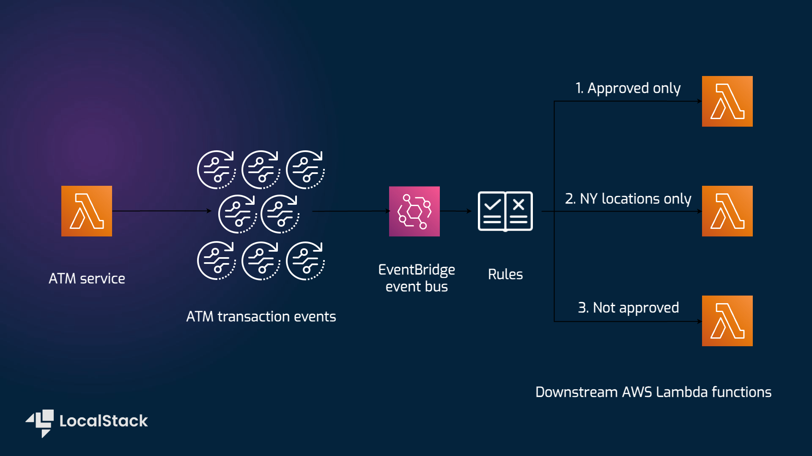

# Producer & Consumer Example using EventBridge, Lambda, and CloudWatch

| Key          | Value                                                                                         |
| ------------ | --------------------------------------------------------------------------------------------- |
| Environment  | LocalStack                                                                                    |
| Services     | EventBridge, Lambda, CloudWatch                                                           |
| Integrations | SAM                                                                                           |
| Categories   | Serverless; Event-driven architecture                                                         |
| Level        | Beginner                                                                                      |
| GitHub       | [Repository link](https://github.com/localstack-samples/sample-eventbridge-producer-consumer) |

## Introduction

The sample application create a Producer & Consumer using two Lambda functions. It is coupled with an EventBridge rule to determine events that are routed to the consumer. The example demonstrates how an ATM application at a bank could generate events, and the rule only passes **Approved** transactions to an event consuming application. Users can deploy this application sample on LocalStack & AWS using Serverless Application Model (SAM) without any changes. To test this application sample, we will demonstrate how you use LocalStack to deploy the infrastructure on your developer machine and in your CI environment. Furthermore, we will showcase how you can check out the event-driven architecture using LocalStack Web Application by verifying the logs.

## Architecture diagram

The following diagram shows the architecture that this sample application builds and deploys:



We are using the following AWS services and their features to build our infrastructure:

* [EventBridge](https://docs.localstack.cloud/user-guide/aws/eventbridge/) to create an event bus that filter the events based upon a specified criteria, and once validated route to the Consumer function.
* [Lambda](https://docs.localstack.cloud/user-guide/aws/lambda/) to create two functions, a producer and a consumer, that are triggered by events on the event bus which is further used to log the events.
* [CloudWatch](https://docs.localstack.cloud/user-guide/aws/cloudwatch/) to create a log group to store the logs generated by the functions, while allow the users to view the logs in the LocalStack Web Application or through the AWS CLI.

## Prerequisites

- LocalStack Pro with the [`localstack` CLI](https://docs.localstack.cloud/getting-started/installation/#localstack-cli).
- [Serverless Application Model](https://docs.localstack.cloud/user-guide/integrations/aws-sam/) with the [`samlocal`](https://github.com/localstack/aws-sam-cli-local) installed.
- [AWS CLI](https://docs.localstack.cloud/user-guide/integrations/aws-cli/) with the [`awslocal` wrapper](https://docs.localstack.cloud/user-guide/integrations/aws-cli/#localstack-aws-cli-awslocal).
- [Node.js 18.x](https://nodejs.org/en/download/) with the [`npm`](https://docs.npmjs.com/downloading-and-installing-node-js-and-npm) package manager. 

Start LocalStack Pro with the `LOCALSTACK_API_KEY` pre-configured:

```shell
export LOCALSTACK_API_KEY=<your-api-key>
DEBUG=1 localstack start
```

We specified `DEBUG=1` to get the printed LocalStack logs directly in the terminal to help us see the event-driven architecture in action. If you prefer running LocalStack in detached mode, you can add the `-d` flag to the `localstack start` command, and use Docker Desktop to view the logs.

## Instructions

### Installing the dependencies

To install the dependencies, run the following command:

```shell
cd atmProducer
npm install
```

### Building the application

To build the SAM application, run the following command from the root directory of the application:

```shell
samlocal build
```

If you see a `Build Succeeded` message, you can proceed to the next step.

### Deploying the application

To deploy the SAM application, run the following command:

```shell
samlocal deploy --guided
```

The above command will create a new managed S3 bucket to store the artifacts of the SAM application. If you want to use an existing S3 bucket, you can use the `--s3-bucket` flag to specify the bucket name. Before being deployed, the CloudFormation changeset will be displayed in the terminal. If you want to deploy the application without confirmation, you can use the `--no-confirm-changeset` flag.

To view the created resources, check out the CloudFormation outputs from deployed stack or run the following commands:

```shell
awslocal lambda list-functions
awslocal events list-rules
```

### Invoking the producer function

You can now invoke the Producer function. This places the events in `events.js` onto the default event bus in EventBridge. To invoke the function, run the following command:

```shell
output=$(awslocal lambda list-functions | grep 'sam-app-atmProducerFn-')
function_name=$(echo "$output" | awk -F'"' '/"FunctionName"/ {print $4}')
awslocal lambda invoke --function-name $function_name --payload '{}' output.txt
```

Navigate to the [CloudWatch Resource Browser](https://app.localstack.cloud/inst/default/resources/cloudwatch/groups) to view the logs generated by the functions:


You can click on the individual Log groups to view the logs. You can also apply custom filters to the logs, or navigate to the Resource Browsers for other AWS services to view the resources created by the sample application.

### GitHub Action

This application sample hosts an example GitHub Action workflow that starts up LocalStack, builds the Lambda functions, and deploys the infrastructure on the runner. You can find the workflow in the `.github/workflows/main.yml` file. To run the workflow, you can fork this repository and push a commit to the `master` branch.

Users can adapt this example workflow to run in their own CI environment. LocalStack supports various CI environments, including GitHub Actions, CircleCI, Jenkins, Travis CI, and more. You can find more information about the CI integration in the  [LocalStack documentation](https://docs.localstack.cloud/user-guide/ci/).

## Learn more

The sample application is based on a public [AWS sample app](https://aws.amazon.com/blogs/compute/integrating-amazon-eventbridge-into-your-serverless-applications/) that deploys an event producer and consumer in Lambda, and creates an EventBridge rule to route events.

## Contributing

We appreciate your interest in contributing to our project and are always looking for new ways to improve the developer experience. We welcome feedback, bug reports, and even feature ideas from the community. Please refer to the [contributing file](CONTRIBUTING.md) for more details on how to get started.
